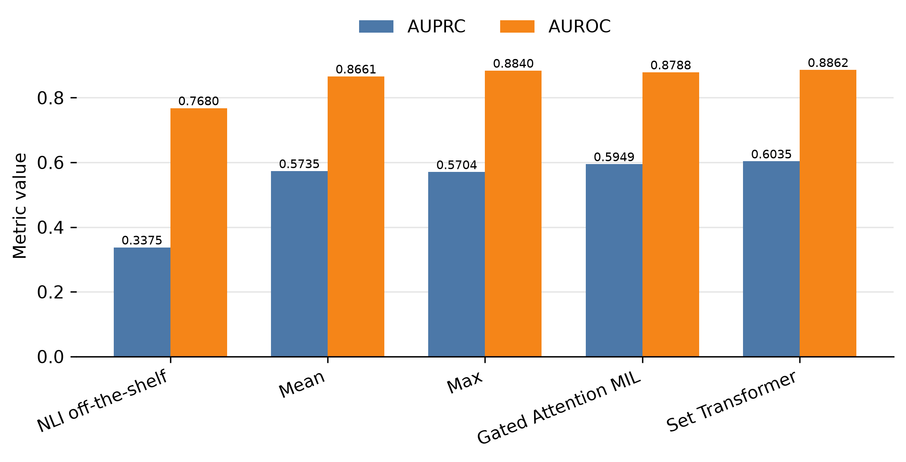

# RAGTruth to PublicHearingBR

This site documents the reproducible experiments in this repository.

Use the **Experiments** section to understand each scientific run. Use the
**Preparation** section before running an experiment on a new machine or
cluster.

The documentation describes frozen experiment artifacts. It does not replace
their manifests, resolved configurations, predictions, metrics, or source code.

## Results at a glance

Under zero-shot direct cross-lingual transfer from English RAGTruth to Portuguese PublicHearingBR, the Set Transformer achieved an AUPRC of **0.6035** and an AUROC of **0.8862**.

This corresponds to a **78.8% relative improvement in AUPRC** over the off-the-shelf multilingual NLI baseline (AUPRC **0.3375**), without using PublicHearingBR labels for training, model selection, or decision-threshold selection.



*AUPRC and AUROC under zero-shot cross-lingual transfer from English RAGTruth to Portuguese PublicHearingBR, comparing the off-the-shelf NLI baseline with different evidence aggregation strategies.*

### Cross-lingual transfer strategies

| Strategy | Configuration | AUPRC |
| --- | --- | ---: |
| Direct transfer | RAGTruth EN → PublicHearingBR PT | **0.6035** |
| Translate-train | RAGTruth PT-NLLB → PublicHearingBR PT | 0.5658 |
| Translate-test | RAGTruth EN → PublicHearingBR EN-NLLB | 0.4062 |

Under the evaluated NLLB conditions, neither translation-based strategy improved over direct transfer. Translate-train reduced Set Transformer AUPRC by 6.2% relative to direct transfer, while translate-test reduced it by 32.7%.

Although the Set Transformer achieved the highest AUPRC point estimate under direct transfer, its difference from Gated Attention MIL was inconclusive under paired bootstrap analysis (ΔAUPRC = 0.0086, 95% CI [−0.0046, 0.0231]).

## Citation

If you use this work, code, or experimental results, please cite:
```bibtex
@misc{leal2026crosslingual,
  title  = {Cross-Lingual Transfer for Evidence-Based Hallucination Detection in PublicHearingBR},
  author = {Leal, Augusto Antônio Fontanive and
            de Souza, Arturo and
            de Brum, Antônio Araújo and
            Laner, João Augusto Tonial},
  year   = {2026}
}
```
